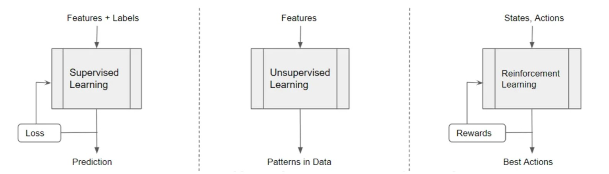

# Deep Q-Network (DQN) - A Complete Guide

> **From Tabular Q-Learning to Neural Networks**
> This document explains DQN concepts in depth with analogies, code walkthroughs, and answers to common confusions.

NOTE: There's another explanation for the same topic, see **[DQN Deep Q-network.md](../docs/05-dqn-deep-q-network.md)**.
---

## Part 1: The Fundamental Question - What Is Our "Reference"?



- Supervised Learning uses labeled data as input, and predicts outcomes. It receives feedback from a Loss function acting as a ‘supervisor’.

- Unsupervised Learning uses unlabeled data as input and detects hidden patterns in the data such as clusters or anomalies. It receives no feedback from a supervisor.

- Reinforcement Learning gathers inputs and receives feedback by interacting with the external world. It outputs the best actions that it needs to take while interacting with that world.

### In Supervised Learning (What You Know)

```
Input: Image of a Cat
Reference/Label: "Cat" (Human provided this!)
Model Output: "Dog"
Loss: Wrong! Label says "Cat". Adjust weights.
```

The reference is a **human-provided label**.

### In Reinforcement Learning (The New Paradigm)

**There IS NO human label.** The "reference" comes from the **REWARD given by the environment**.

```
State: Pole tilting at 0.2 radians
Action: Push Left
Result: Pole fell!
Reward: 0 (Game over)    ← This is our "reference"!
```

**Key Insight:** The environment is our teacher. When the pole falls, we get punished. When it stays up, we get +1. No human needs to label "good" or "bad."

---

## Part 2: Comparing Tabular vs Deep Q-Learning

### Tabular Q-Learning (What We Did in P0/P1)

#### In Tabular Q-Learning (FrozenLake):

```
State: Position 5
Action: Move Right
Result: Fell in hole!
Reward: -10 (Environment gave this!)
Reference: -10 + 0.99 * 0 = -10  ← This IS the target!

Update: Q[5, Right] = Q[5, Right] + α * (-10 - Q[5, Right])
```
The "reference" is: `reward + γ * max(Q[next_state, :])`

This works because the Q-table is FIXED. Cell [5, Right] only affects cell [5, Right].

```python
# FrozenLake: 16 states × 4 actions = 64 cells
Q = np.zeros((16, 4))

# Update ONE cell at a time:
Q[state, action] = Q[state, action] + α * (reward + γ * max(Q[next_state, :]) - Q[state, action])
```

**Why This Works:**
- Fixed state space (16 states)
- Each cell is independent
- Updating Q[5, Right] doesn't affect Q[3, Left]
- The "target" (`reward + γ * max(Q[next_state])`) uses fixed table values

### Deep Q-Learning (What We're Doing Now)

```python
# CartPole: Infinite states (continuous)
network = DQN(input=4, output=2)  # 33,000+ parameters

# Update ALL parameters at once via backpropagation
loss = (predicted_Q - target_Q)²
loss.backward()
optimizer.step()
```

**The Problem:**
- Updating one weight affects ALL predictions
- The "target" also changes when we update (it uses the same network!)
- This creates instability

---

## Part 3: CartPole - Input and Output Explained

### What Is The INPUT?

```python
state = [cart_position, cart_velocity, pole_angle, pole_angular_velocity]
# Example: [0.02, -0.5, 0.1, 0.8]
```

| Feature | Meaning | Range |
|---------|---------|-------|
| `cart_position` | Where is cart on track? | -2.4 to +2.4 |
| `cart_velocity` | How fast is cart moving? | -∞ to +∞ |
| `pole_angle` | How tilted is the pole? | -0.2 to +0.2 radians |
| `pole_angular_velocity` | How fast is pole tilting? | -∞ to +∞ |

If `pole_angle > 0.2 radians`, the game is over.

**Note:** These are continuous floating-point numbers! You cannot make a table row for `0.02345...`

### What Is The OUTPUT?

```python
Q_values = network(state)  # → [Q_left, Q_right]
# Example: [2.3, 5.1] means "Right action has higher value"

action = argmax([2.3, 5.1])  # → 1 (Right)
```

### What Is The REWARD?

```python
# The ENVIRONMENT gives this, NOT US!
if pole_still_upright and cart_on_track:
    reward = +1  # Every frame you survive, good job, keep going!
else:
    reward = 0   # Game over
    done = True
```

**The reference is NOT "vertical pole = good."**
**The reference is: Did the environment give +1 or did the game end?**

---

## Part 4: The Training Loop - Step by Step

### Phase 1: Exploration (Collecting Data)

```python
# Episode 1, Step 1:

# 1. OBSERVE the state
state = [0.02, -0.5, 0.1, 0.8]  # Pole tilting right

# 2. NETWORK PREDICTS (initially random weights!)
q_values = policy_net(state)  # → [0.3, 0.5] (random garbage)

# 3. PICK ACTION (epsilon=1.0 means 100% random initially)
if random.random() < epsilon:  # epsilon = 1.0 at start
    action = random.choice([0, 1])  # Random exploration
else:
    action = q_values.argmax()  # Exploitation (not yet)

# 4. TAKE ACTION, GET REWARD FROM ENVIRONMENT
next_state, reward, done = env.step(action)
# next_state = [0.03, -0.3, 0.05, 0.4]  # Pole more upright!
# reward = +1 (Pole didn't fall!)
# done = False

# 5. STORE IN MEMORY (Experience Replay Buffer)
memory.push(state, action, reward, next_state, done)
# Stored: ([0.02, -0.5, 0.1, 0.8], 1, +1, [0.03, -0.3, 0.05, 0.4], False)
```

**No training yet!** We're just playing randomly and recording what happens.

### Phase 2: Training Begins (After 64 Experiences [BATCH_SIZE])

```python
# 6. SAMPLE 64 random experiences from memory
states, actions, rewards, next_states, dones = memory.sample(64)

# 7. ASK POLICY NETWORK: "What did you predict for these states?"
current_q = policy_net(states).gather(1, actions)
# → 64 predictions, one per experience like  [0.3, 0.5], [0.2, 0.7], ...

# 8. ASK TARGET NETWORK: "What's the best Q-value for next_states?"
max_next_q = target_net(next_states).max(1)[0].detach()
# → 64 numbers representing "future potential" like 0.6, 0.8, 0.4, ...

# 9. CALCULATE THE "TARGET" (This is our reference!)
target_q = rewards + GAMMA * max_next_q * (1 - dones)
# If reward=+1 and max_next_q=0.6:
# target_q = 1 + 0.99 * 0.6 = 1.59

# 10. CALCULATE LOSS
loss = MSELoss(current_q, target_q)
# If we predicted 0.5 but target was 1.59:
# loss = (0.5 - 1.59)² = 1.19

# 11. BACKPROPAGATE AND UPDATE WEIGHTS
optimizer.zero_grad()  # Clear old gradients
loss.backward()        # Calculate new gradients
optimizer.step()       # Adjust weights
```

**NOW the student has learned!**  Its weights changed. Weights adjusted to predict 1.59 instead of 0.5.

---

## Part 5: The Target Network - Why Two Brains?

Why Target Network? (The Tail-Chasing Problem)

Here's your concern: "Both networks start with random weights. How can blind lead blind?"

### The Problem: Chasing Your Own Tail


Remember the Q-Learning update:

```
Target = reward + γ × max(Q(next_state))
                        ↑
                This is OUR OWN prediction!
```

**In Tables:** This works because each cell is independent.

**In Neural Networks:** This is CATASTROPHIC because updating one weight changes ALL predictions.

### The Tail-Chasing Visualization

```
WITHOUT Target Network (Unstable):
──────────────────────────────────
Step 1: 
  Policy predicts: Q = 0.5
  Target = 1 + 0.99 * Policy(next) = 1 + 0.99 * 0.6 = 1.59
  Update Policy towards 1.59

Step 2:
  Policy NOW predicts: Q = 0.8 (improved!)
  BUT Target ALSO changed: = 1 + 0.99 * 0.9 = 1.89 (MOVED!)
  
Step 3:
  Policy predicts: Q = 1.2
  Target moved again: = 1 + 0.99 * 1.1 = 2.09

THE TARGET KEEPS RUNNING AWAY! Like a dog chasing its tail.
```

### The Solution: Freeze The Target

```
WITH Target Network (Stable):
──────────────────────────────
Step 1:
  Policy predicts: Q = 0.5
  Target (FROZEN) = 1 + 0.99 * 0.6 = 1.59
  Update Policy towards 1.59

Step 2:
  Policy predicts: Q = 0.8
  Target STILL = 1.59 (Frozen! Didn't move!)
  
Step 3-100:
  Policy converges to ~1.59 because target is stable!

Step 101 (SYNC weights):
  Copy Policy → Target
  Target now represents smarter estimates
  New target = 1 + 0.99 * 0.8 = 1.79

We climb a STAIRCASE, not chase our tail!
```

### Code: Creating Two Brains

```python
# In train_dqn.py:

# Brain 1: THE STUDENT (Policy Network) - Actively learning
policy_net = DQN(state_size, action_size).to(device)

# Brain 2: THE TEACHER (Target Network) - Frozen copy
target_net = DQN(state_size, action_size).to(device)
target_net.load_state_dict(policy_net.state_dict())  # Clone weights!
target_net.eval()  # Freeze - no gradients, no learning
```

### Code: Using Both Brains

```python
# During training:

# STUDENT answers: "What Q-value did I predict?"
current_q = policy_net(states).gather(1, actions)

# TEACHER answers: "What should the Q-value be?" (frozen!)
max_next_q = target_net(next_states).max(1)[0].detach()
target_q = rewards + GAMMA * max_next_q * (1 - dones)

# Compare and learn
loss = MSELoss(current_q, target_q)
loss.backward()  # Only updates STUDENT
optimizer.step()
```

### Code: Syncing Teacher

```python
# Every N episodes, promote the Student to Teacher:
if episode % TARGET_UPDATE == 0:
    target_net.load_state_dict(policy_net.state_dict())
    # "Student, you've learned enough. You are now the Teacher."
```

---

## Part 6: The Bootstrap Problem - "Blind Leading Blind?"

### Your Concern

> "Both networks start with random weights. How can blind lead blind?"

### The Answer: The REWARD Is Real

Even with random actions, the environment gives REAL feedback!

Basically, even with a dumb teacher, the student can still learn from the environment to validate its predictions and see if it's getting better or worse.

```
Episode 1 (Random actions):
  State: Pole tilting at 0.2 radians
  Action: Random → Push Left
  Result: Pole fell! 
  Reward: 0, done = True   ← REAL feedback from environment!
  Memory: (tilting_state, left, 0, dead_state, True)
  
Episode 2 (Random actions):
  State: Pole tilting at 0.1 radians
  Action: Random → Push Right
  Result: Pole recovered! 
  Reward: +1  ← REAL feedback from environment!
  Memory: (tilting_state, right, +1, upright_state, False)
```

**The memory now contains:**
- (tilting, left) → reward 0, game ended
- (tilting, right) → reward +1, game continued

**When we train, the network learns:**
> "In tilting states, Right gave +1, Left gave 0. Right is better!"

### Even with random actions, we get REAL rewards!

Now when we train:

- Experience 1: (tilting, left) → reward 0, game ended
- Experience 2: (tilting, right) → reward +1, game continues

The network learns: **"When tilting, Right gives +1, Left gives 0. Right is better!"**

This is the bootstrap: Random exploration finds SOME rewards, and we use those to build better estimates.

### The Bootstrap Process

```
Step 1: Random exploration finds SOME rewards
        "Going right when tilting = +1"

Step 2: Network learns this pattern
        Q(tilting, right) increases
        
Step 3: Better Q-values → Better action selection
        Start exploiting: choose Right when tilting
        
Step 4: Better actions → More rewards discovered
        Survive longer → Find more +1 rewards
        
Step 5: Repeat → Network gets better and better
```

**This is "bootstrapping" - pulling yourself up by your own bootstraps.**

---

---

## Part 7: The Cooking Analogy

Imagine you're learning to cook with two notebooks.

### Phase 1: Random Exploration

```
1. EXPLORATION: You randomly try spices:
- Add salt to chicken → Tastes good! (Reward +1)
- Add sugar to chicken → Tastes bad! (Reward -1)
- Add pepper to fish → Tastes great! (Reward +2)

2. MEMORY: You write down what happened (Experience Replay):
- "salt + chicken = +1"
- "sugar + chicken = -1"
- "pepper + fish = +2"
```

### Phase 2: Learning Patterns

```
3. STUDENT NETWORK: Student Notebook (Policy Network):
- Reviews random memories
- Learns: "Salt tends to work, sugar doesn't"
- Starts predicting: "Salt = +1, Sugar = -1"

4. TARGET NETWORK: Recipe Book (Target Network):
- A frozen copy of your knowledge
- You don't rewrite it every minute
- Provides stable reference
```

### Phase 3: Updating The Recipe Book

```
After a week of experiments:
- Copy Student Notebook → Recipe Book
- Recipe Book now has your improved knowledge
- Student continues learning with better baseline
```
- - - - - - - - - - - - - - - - - - - - - - - 
### Why The Recipe Book Works

WITHOUT frozen recipe book:
```
- "This dish should taste like X" and X keeps changing every minute/second
- You can never converge on a recipe
```

WITH frozen recipe book:
```
- "This dish should taste like X" stays fixed for a week
- You practice hitting that target
- Then X gets updated to a better goal
```

The REWARD (how the dish tastes) is the TRUTH.
The networks just help you generalize from examples.

# **The Target Network doesn't provide knowledge. It provides STABILITY.**

---

## Part 8: Summary - The DQN Learning Cycle

```
┌─────────────────────────────────────────────────────────────────────┐
│                    THE DQN LEARNING CYCLE                           │
├─────────────────────────────────────────────────────────────────────┤
│                                                                     │
│  PHASE 1: EXPLORATION (Steps 0-64, no training yet)                │
│  ─────────────────────────────────────────────────                  │
│  • Take random actions (epsilon = 1.0)                              │
│  • Environment gives rewards (+1 or game over)                      │
│  • Store (state, action, reward, next_state) in memory              │
│  • No weight updates yet - just collecting data!                    │
│                                                                     │
│  PHASE 2: TRAINING BEGINS (After 64 experiences)                   │
│  ────────────────────────────────────────────────                   │
│  Every step after this:                                             │
│  • Sample 64 random memories (break correlation!)                   │
│  • Policy Network predicts Q-values (Student guess)                 │
│  • Target Network provides stable reference (frozen Teacher)        │
│  • Loss = (Student guess - Teacher target)²                         │
│  • Backprop updates Policy Network weights ONLY                     │
│  • Target Network stays FROZEN                                      │
│                                                                     │
│  PHASE 3: TARGET SYNC (Every N episodes)                           │
│  ────────────────────────────────────────                          │
│  • Copy Policy weights → Target                                     │
│  • Teacher becomes "smarter"                                        │
│  • Cycle repeats with higher-quality targets                        │
│                                                                     │
│  THE REAL REFERENCE IS THE REWARD FROM ENVIRONMENT!                │
│  The target network just provides stability, not knowledge.         │
│                                                                     │
└─────────────────────────────────────────────────────────────────────┘
```

---

## Part 9: Key Takeaways

| Concept | Purpose |
|---------|---------|
| **Experience Replay** | Store memories, sample randomly to break correlation |
| **Target Network** | Provides stable learning target (frozen) |
| **Policy Network** | The network that actually learns (updates every step) |
| **Epsilon-Greedy** | Explore early (random), exploit later (use network) |
| **Batch Training** | Learn from 64 experiences at once (efficiency) |

### The DQN Recipe

```
1. NEURAL NETWORK     → Replace Q-table with function approximator
2. REPLAY BUFFER      → Store experiences, sample randomly
3. TARGET NETWORK     → Stable target (don't chase your tail)
4. ε-GREEDY           → Explore early, exploit later
5. BATCH TRAINING     → Learn from multiple experiences at once
```

---

## Part 10: Answering Common Confusions

### Q: "What is the reference if there's no human label?"

**A:** The REWARD from the environment is the reference. When pole falls, reward = 0. When it stays up, reward = +1. The target is: `reward + γ × future_value`.

### Q: "How can two random networks learn anything?"

**A:** Random exploration still finds SOME rewards. "Going right when tilting gave +1" is real information. We bootstrap from these discoveries.

### Q: "Why freeze the target network?"

**A:** Without freezing, the target moves every time we update weights. The network chases its own tail. Freezing provides a stable goal to aim for.

### Q: "What happens from step 0 to N?"

**A:** Exploration! Random actions, but we record what happened. After N experiences, we sample from memory and start training. The target network provides stability during training.

### Q: "Why copy weights every N episodes, not every step?"

**A:** Stability. If we update the target every step, it's the same as having no target network. N episodes of stable target allows the policy to converge before moving the goal.


Does this clarify the confusion? The main points are:

1. **The REWARD** is the ground truth - environment provides it
2. **Both networks start random** - but random exploration finds SOME good moves
3. **Target Network = stability** - not knowledge, just a fixed goal to aim at
4. **Student updates every step** - Target updates every N episodes
5. **Bootstrap learning** - we use our own improving estimates, but anchored by real rewards

---

## Part 11: The Bridge to LLMs

```
DQN:
  State → Network → Q-values → argmax → Action
  
Policy Gradient (coming in P3):
  State → Network → Probabilities → Sample → Action

LLMs ARE Policy Networks:
  Context → Transformer → Token Probabilities → Sample → Token
```

DQN still calculates values and derives actions. The next step is learning the policy DIRECTLY - which is how LLMs actually work!

---

**Congratulations!** You now understand the core concepts of Deep Q-Learning:
- Why tables fail for continuous states
- How neural networks approximate Q-values
- Why we need Experience Replay (break correlation)
- Why we need Target Networks (stability)
- How bootstrap learning works (reward is ground truth)
