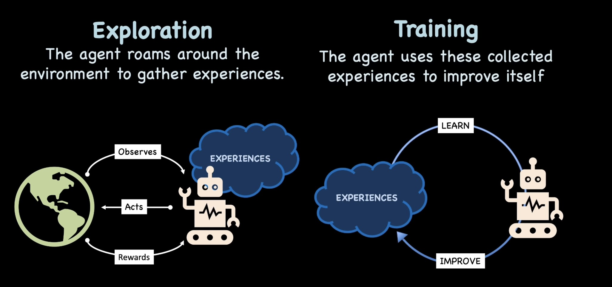
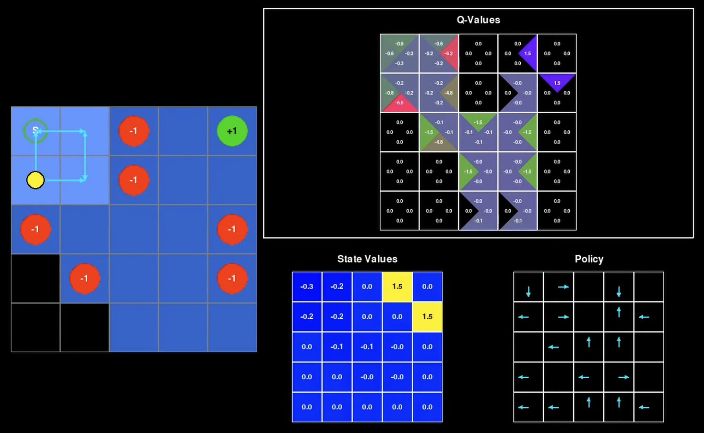

# 🎮 Reinforcement Learning by ReinforcedLearning

> **From Frozen Lakes to Coding Agents** — A hands-on learning path through Reinforcement Learning fundamentals to modern LLM agent training.

[](https://python.org)
[](https://gymnasium.farama.org/)
[](LICENSE)

---

This is my personal **Reinforcement Learning learning notes**, starting from the absolute basics and building up to training coding agents. This will keep getting updated as I learn more and more.

### The Learning Path (v1)

```
P0: Frozen Lake          → Understand Agents, States, Actions, Random Policy
P1: Cliff Walking        → Q-Learning, Epsilon-Greedy, Exploration vs Exploitation
P2: Cart Pole (DQN)      → Deep RL, Neural Networks as Function Approximators
P3: LunarLander (PPO)    → Policy Gradient, Actor-Critic, Stable Training
P4: Coding Agent (RLHF)  → Human Feedback, DPO, Real-World Agent Training
```

---

## 🧠 The Six Pillars of Reinforcement Learning

Every single AI agent—from the simple Elf on the Frozen Lake to advanced Coding Agents—must answer these **6 fundamental questions** to exist. These are the **"Constitution of Reinforcement Learning."**

### Q1: What does the agent *see*, and what is it allowed to *do*?

**The Concept:** **State Space (S) & Action Space (A)**

| Component | Description | Frozen Lake Example | Coding Agent Example |
|-----------|-------------|---------------------|---------------------|
| **See (S)** | The Observation | "I am at Index 5" | Code + Error message |
| **Do (A)** | The Action | {Up, Down, Left, Right} | {Delete Line, Insert Text, Run Build} |

> ⚠️ **Why it matters:** If the agent can't *see* the cliff (i.e., if the state doesn't contain that info), it can never learn to avoid it.

---

### Q2: How does the agent *explore* and collect *experiences*?

**The Concept:** **Exploration Strategy & Reward Signal**

- **Exploration:** Strategies like **Epsilon-Greedy** (flipping a coin to act randomly) to discover new paths
- **Extrinsic Rewards:** Points given by the *environment* (e.g., -100 for falling off the cliff). This is the "Salary."
- **Intrinsic Rewards:** Points the agent gives *itself* for being curious. (+1 for visiting a new square)



> ⚠️ **Why it matters:** Without exploration, the agent just repeats the first safe path it finds (which might be terrible).

---

### Q3: Does the agent practice in the environment, or in its *dream*?

**The Concept:** **Model-Free vs. Model-Based RL**

| Approach | Description | Example |
|----------|-------------|---------|
| **Model-Free** | Learn by trial and error. No simulation. | Q-Learning, PPO |
| **Model-Based** | Build a mental model, simulate before acting | AlphaGo, World Models |

**Model-Free (what we use):**
> The agent moves, fails, and learns. It doesn't know "physics"; it just knows "Fire = Ouch."

**Model-Based:**
> The agent thinks, *"If I step left, the ice implies I might slip... let me simulate that 50 times in my head before I actually move."*

> ⚠️ **Why it matters:** Model-Free (Q-Learning/PPO) is simpler and what we use for LLMs. Model-Based is faster but harder to build.

---

### Q4: How does the agent *evaluate* its current state?

**The Concept:** **Value Function (V) vs. Policy Only**

| Approach | Description | Data Structure |
|----------|-------------|----------------|
| **Value-Based** | Assigns a score to every state | Q-Table, Value Network |
| **Policy-Only** | Learns reflexes, no evaluation | Policy Network |



**Value-Based (Q-Learning):**
> *"Being on the edge of the cliff is a 2/10 state. Being near the goal is a 9/10 state."*

**Policy Gradient (LLMs):**
> *"If Error → Fix Syntax."* Skip evaluation, go straight to action.

> ⚠️ **Why it matters:** Evaluation helps the agent plan ahead. Reflexes help it act fast.

---

### Q5: How are *future rewards* consolidated?

**The Concept:** **Discount Factor (γ, Gamma)**

The agent asks: *"Is a candy worth more now, or 10 steps from now?"*

```
Total Value = Reward_Now + (γ × Reward_Next) + (γ² × Reward_Later) + ...

Where γ = 0.99 (typically)
```

| Gamma Value | Behavior |
|-------------|----------|
| γ = 0 | Short-sighted, hedonistic (only cares about NOW) |
| γ = 0.99 | Patient, plans ahead |
| γ = 1 | Infinitely patient (sometimes too patient) |

> ⚠️ **Why it matters:** If Gamma is 0, the agent is greedy. If Gamma is 1, the agent might never finish because it's too focused on the infinite future.

---

### Q6: How does the agent *learn new things* without *forgetting* what works?

**The Concept:** **Plasticity vs. Stability (Learning Rate α)**

**The Conflict:**
- Learn too fast (High α) → Overwrite old smart moves with new stupid mistakes
- Learn too slow (Low α) → Never improve

**The Solution:**
- Tune the **Learning Rate** (e.g., 0.001) to update gently
- Use **Experience Replay** (Deep RL) — keep a "Diary" of past games, review randomly

```python
# The Q-Learning Update Rule
Q[state, action] = Q[state, action] + α * (reward + γ * max(Q[next_state]) - Q[state, action])
                                      ↑
                              Learning Rate (gentle update)
```

> ⚠️ **Why it matters:** This is the #1 reason RL projects fail—the agent learns a new trick and forgets how to walk.

---

---

## Key Concepts Quick Reference

### The RL Loop (Markov Decision Process)

```
    ┌─────────┐     Action (aₜ)       ┌─────────────────┐
    │         │ ────────────────────>│                 │
    │  AGENT  │                      │   ENVIRONMENT   │
    │         │ <────────────────────│                 │
    └─────────┘   State (sₜ₊₁)        └─────────────────┘
                  Reward (rₜ)
```

### Core Equations

| Equation | Name | Purpose |
|----------|------|---------|
| `π(a\|s)` | Policy | Probability of action given state |
| `V(s)` | Value Function | Expected future reward from state |
| `Q(s,a)` | Q-Function | Expected future reward from state-action pair |
| `V(s) = max_a [r(s,a) + γV(s')]` | Bellman Equation | The core of RL |

### Algorithm Comparison

| Algorithm | Type | Value Function | Policy | Used For |
|-----------|------|----------------|--------|----------|
| Q-Learning | Model-Free | Q-Table | Implicit | Simple envs |
| DQN | Model-Free | Neural Net | Implicit | Atari games |
| PPO | Model-Free | Critic Net | Actor Net | LLM training |
| DPO | Preference | None | Direct | LLM fine-tuning |

---

## Learning Resources

For a comprehensive list of courses, papers, blogs, and tools, see **[REFERENCES.md](docs/REFERENCES.md)**.

### Quick Start Resources
- 🎓 [Hugging Face Deep RL Course](https://huggingface.co/learn/deep-rl-course/unit0/introduction) - Best beginner course
- 🛠️ [Gymnasium](https://gymnasium.farama.org/) - Standard RL environment library

---

## License

MIT License - Learn, build, and share!

```
      Generate → Execute → Feedback → Learn → Repeat
           ↑                                    │
           └────────────────────────────────────┘
```