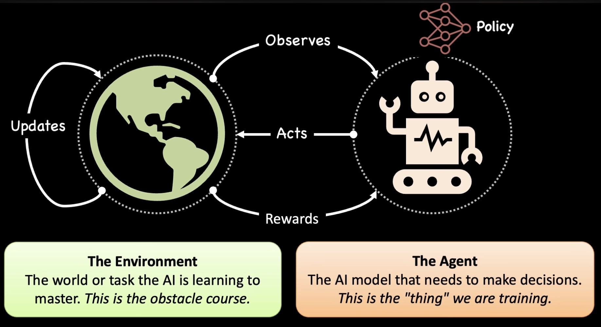
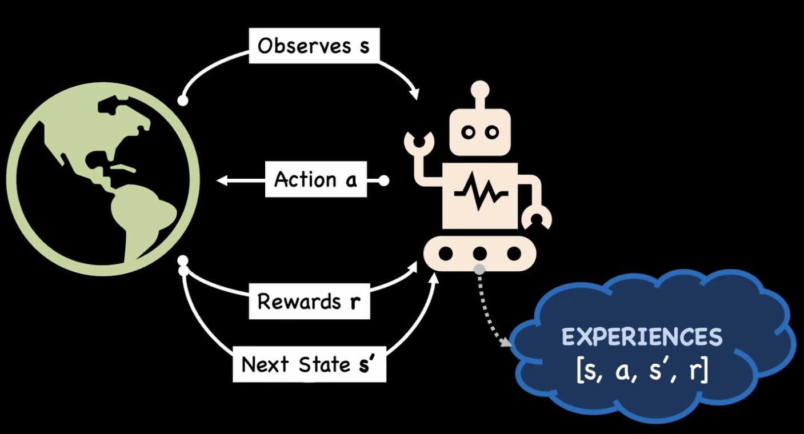
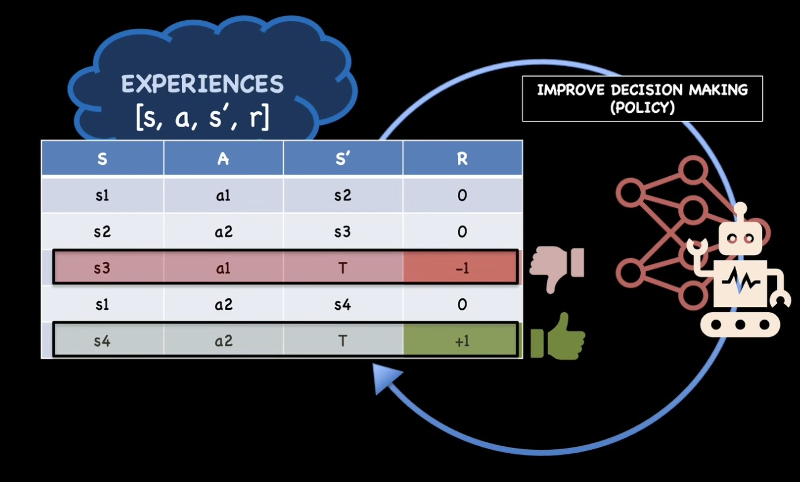

# RL Fundamentals: Key Concepts & Terminology

---

## The Big Picture

Reinforcement Learning is about an **Agent** learning to make **Decisions** in an **Environment** to maximize **Rewards**.



Think of it like training a dog:
- **Agent** = The dog
- **Environment** = The world (park, house, etc.)
- **Actions** = Sit, run, fetch
- **Reward** = Treats, praise
- **Goal** = Dog learns which actions get treats

---

## The Core Loop



```
At each timestep t:
1. Agent observes state sₜ
2. Agent takes action aₜ
3. Environment returns:
   - Next state sₜ₊₁
   - Reward rₜ
4. Agent stores experience [sₜ, aₜ, sₜ₊₁, rₜ]
5. Repeat until done
```



---

## 1. States & Observations

### State (s)
The **complete** information about the environment at time t.

```python
# Examples of states:
chess_state = full_board_position  # Every piece position
game_state = all_game_variables    # HP, mana, inventory, etc.
robot_state = position + velocity + sensor_data
```

### Observation (o)
What the agent actually **sees** - may be partial/incomplete.

```python
# State vs Observation
poker_state = all_player_cards      # Including hidden ones
poker_observation = my_cards_only    # What I can actually see

driving_state = entire_road_info     # All cars, all signals
driving_observation = camera_view    # What my sensors capture
```

### Key Insight

```
If you're building a game AI:
- STATE = What the game engine knows (everything)
- OBSERVATION = What you pass to the agent (features/pixels)

Most RL assumes: observation ≈ state (fully observable)
Real world: observation ⊂ state (partially observable)
```

| Type | Agent Sees | Example |
|------|-----------|---------|
| **Fully Observable** | Complete state | Chess (whole board visible) |
| **Partially Observable** | Subset of state | Poker (hidden cards), FPS games (fog of war) |

---

## 2. Action Spaces

The **set of all possible actions** an agent can take.

Different environments allow different kinds of actions. The set of all valid actions in a given environment is often called the **action space**. Some environments, like Atari and Go, have **discrete action spaces**, where only a finite number of moves are available to the agent. Other environments, like where the agent controls a robot in a physical world, have **continuous action spaces**. In continuous spaces, actions are real-valued vectors.

### Discrete Action Space
Finite, countable actions.

```python
# Frozen Lake
action_space = [UP, DOWN, LEFT, RIGHT]  # 4 actions

# Atari Games
action_space = [NOOP, FIRE, UP, DOWN, LEFT, RIGHT, ...]  # 18 actions

# Code: Taking an action
action = env.action_space.sample()  # Random action
action = 2  # Specific action (e.g., LEFT)
```

### Continuous Action Space
Infinite, real-valued actions.

```python
# Car steering
action = 0.35  # Steering angle between [-1, 1]

# Robot arm
action = [0.1, -0.3, 0.7]  # Joint angles/torques

# Code: Taking an action
action = np.array([0.35, 0.8])  # [steering, acceleration]
```

### Comparison

| Discrete | Continuous |
|----------|-----------|
| Finite choices | Infinite choices |
| Use: Epsilon-Greedy, Q-Learning | Use: Noise, Policy Gradient |
| Example: Game controls | Example: Robotics, driving |

### For Coding Agents

```python
# Discrete (simpler)
action_space = ["insert_line", "delete_line", "replace_word", "run_code"]

# Continuous (token-level generation)
action = probability_distribution_over_vocabulary  # Softmax output
```

---

## 3. Policy (π)

**The brain of the agent.** Maps states to actions.

```
Policy = "Given this situation, what should I do?"
```

A policy is a rule used by an agent to decide what actions to take.
A policy can be **deterministic** (denoted μ: `a = μ(s)`) or **stochastic** (denoted π: `a ~ π(·|s)`). Because the policy is essentially the agent's brain, it's common to substitute "policy" for "agent" — e.g., saying "The policy is trying to maximize reward."

In Deep RL, we deal with **parameterized policies**: policies whose outputs depend on a set of parameters (e.g., the weights and biases of a neural network) which we can adjust via optimization. We denote policy parameters by θ or ϕ, writing `πθ(a|s)` to highlight this connection.

### Deterministic Policy
Same state → Always same action.

```python
def deterministic_policy(state):
    if state == "enemy_near":
        return "attack"
    elif state == "low_health":
        return "retreat"
    else:
        return "explore"

# Always returns the SAME action for a given state
```

### Stochastic Policy
Same state → Probability distribution over actions.

```python
def stochastic_policy(state):
    if state == "enemy_near":
        return {"attack": 0.7, "retreat": 0.2, "explore": 0.1}
    # Returns PROBABILITIES, not a fixed action

# Sample from distribution
action = random.choices(actions, weights=probabilities)[0]
```

### Why Stochastic?

| Deterministic | Stochastic |
|--------------|-----------|
| Always predictable | Can surprise |
| Easier to exploit | Better exploration |
| Use: Q-Learning | Use: Policy Gradient, PPO |

### Neural Network as Policy

```python
# Modern RL: Policy is a neural network!
class PolicyNetwork(nn.Module):
    def __init__(self, state_dim, action_dim):
        self.net = nn.Sequential(
            nn.Linear(state_dim, 128),
            nn.ReLU(),
            nn.Linear(128, action_dim),
            nn.Softmax(dim=-1)  # Output probabilities
        )
    
    def forward(self, state):
        return self.net(state)  # π(a|s)

# Usage
policy = PolicyNetwork(state_dim=4, action_dim=2)
action_probs = policy(state)  # [0.8, 0.2] → 80% action 0, 20% action 1
```

### LLM as Policy

```python
# For coding agents, the LLM IS the policy!
def llm_policy(state):
    # state = "Fix this error: ImportError..."
    action = llm.generate(state, temperature=0.7)
    # action = "import numpy # add this line"
    return action

# Temperature controls stochasticity:
# Low temp (0.1) → More deterministic
# High temp (1.0) → More stochastic
```

---

## 4. Rewards & Return

### Reward (r)
Immediate feedback from environment after taking action.

```python
# Frozen Lake
if reached_goal:
    reward = +1
elif fell_in_hole:
    reward = -1  # or 0, depends on design
else:
    reward = 0   # Each step

# Coding Agent
if code_compiles:
    reward = +1
if tests_pass:
    reward = +5
if style_violations:
    reward = -0.1
```

### Return (G)
**Total accumulated reward** over an episode (or trajectory).

```python
# Simple sum
G = r₀ + r₁ + r₂ + ... + rₙ

# Discounted sum (more common)
G = r₀ + γr₁ + γ²r₂ + ... + γⁿrₙ

# Where γ (gamma) = discount factor, typically 0.99
```

### Why Discount?

```python
# Without discount (γ = 1):
# "Reward now = Reward in 1000 steps"
# Problem: Agent might delay forever

# With discount (γ = 0.99):
# "Reward now > Reward later"
# r_now = 1.0
# r_100_steps_later = 0.99^100 ≈ 0.37

# Encourages: Get rewards sooner!
```

| Gamma | Meaning | Agent Behavior |
|-------|---------|----------------|
| γ = 0 | Only immediate | Greedy, no planning |
| γ = 0.9 | Moderate discount | Balances now vs later |
| γ = 0.99 | Almost no discount | Plans far ahead |
| γ = 1 | No discount | May never converge |

---

## 5. Trajectories

A **trajectory (τ)** is a sequence of states, actions, and rewards given in the environment.

```python
# One episode/trajectory:
τ = [s₀, a₀, r₀, s₁, a₁, r₁, s₂, a₂, r₂, ..., sₙ]

# Example: Frozen Lake episode
trajectory = [
    (state=0, action=RIGHT, reward=0),
    (state=1, action=RIGHT, reward=0),
    (state=2, action=DOWN,  reward=0),
    (state=6, action=DOWN,  reward=0),
    (state=10, action=DOWN, reward=0),
    (state=14, action=RIGHT, reward=+1),  # Goal!
]
```

### Why It Matters
- **Training data** = Collection of trajectories
- **Experience replay** = Sample from past trajectories
- **Policy evaluation** = Average return across trajectories

> 💡 **Note:** Trajectories are also frequently called **episodes** or **rollouts**.

### State Transitions

State transitions (what happens between state sₜ and sₜ₊₁) are governed by the natural laws of the environment and depend only on the most recent action aₜ. Actions come from the agent according to its policy.

**Deterministic transition:**
```
sₜ₊₁ = f(sₜ, aₜ)     # Next state is fully determined
```

**Stochastic transition:**
```
sₜ₊₁ ~ P(·|sₜ, aₜ)   # Next state is sampled from probability distribution
```

| Type | Example |
|------|---------|
| **Deterministic** | Chess (move piece → exact new position) |
| **Stochastic** | Frozen Lake (slippery ice → might land elsewhere) |

---

## 6. Value Functions

"How good is it to be in this state?" or "How good is this action?"

### State-Value Function V(s)
Expected return starting from state s, following policy π.

```python
# V(s) = "If I'm in state s, how much reward can I expect?"

V(near_goal) = 0.9    # Good state, high expected reward
V(near_cliff) = -0.5  # Bad state, likely to fall
V(random_state) = 0.3 # Okay state
```

### Action-Value Function Q(s, a)
Expected return starting from state s, taking action a, then following policy π.

```python
# Q(s, a) = "If I'm in state s and take action a, how much reward?"

Q(near_cliff, JUMP_BACK) = 0.5   # Good action in bad state
Q(near_cliff, WALK_FORWARD) = -1 # Bad action, will fall
Q(near_goal, GO_TO_GOAL) = 1.0   # Best action
```

### The Relationship

```
V(s) = max_a Q(s, a)  # Value of state = Best action's Q-value

# Or for stochastic policy:
V(s) = Σ π(a|s) * Q(s, a)  # Weighted average over all actions
```

### Q-Table Example

```python
# What you build in Q-Learning:
Q_table = {
    state_0: {UP: 0.1, DOWN: 0.3, LEFT: 0.0, RIGHT: 0.5},
    state_1: {UP: 0.4, DOWN: 0.2, LEFT: 0.1, RIGHT: 0.8},
    # ...
}

# Best action = argmax Q(state, *)
best_action = max(Q_table[state], key=Q_table[state].get)
```

---

## 7. The RL Optimization Problem

**Goal:** Find a policy π that maximizes expected return.

```
π* = argmax_π E[G | π]

In English:
"Find the policy that, on average, gets the most total reward."
```

### How to Optimize

| Approach | Method | Example Algorithms |
|----------|--------|-------------------|
| **Value-Based** | Learn Q(s,a), derive policy | Q-Learning, DQN |
| **Policy-Based** | Learn π(a\|s) directly | REINFORCE, Policy Gradient |
| **Actor-Critic** | Learn both V(s) and π(a\|s) | A2C, PPO, SAC |

### The Key Equations

```python
# Bellman Equation (foundation of value-based RL)
Q(s, a) = r + γ * max_a' Q(s', a')

# Policy Gradient (foundation of policy-based RL)
∇J(θ) = E[∇log π(a|s) * Q(s, a)]

# "Increase probability of actions that got high reward"
```

---

## Quick Reference Card

| Term | Symbol | Meaning | Example |
|------|--------|---------|---------|
| **State** | s | Current situation | Board position, code state |
| **Observation** | o | What agent sees | Screen pixels, text |
| **Action** | a | What agent does | Move, type, click |
| **Reward** | r | Immediate feedback | +1 for goal, -1 for fail |
| **Return** | G | Total episode reward | Sum of all rewards |
| **Policy** | π | Decision function | π(a\|s) = probability |
| **Value** | V(s) | Expected return from state | "How good is this state?" |
| **Q-Value** | Q(s,a) | Expected return from (state, action) | "How good is this action?" |
| **Discount** | γ | Future reward weight | 0.99 typical |
| **Episode** | τ | One complete run | Start to terminal state |

---

## Analogy: Building a Web App

| RL Concept | Web Dev Analogy |
|-----------|-----------------|
| **Environment** | Production server |
| **Agent** | Your code/bot |
| **State** | Current app state (DB, session) |
| **Action** | API call, DB write |
| **Reward** | User engagement, revenue |
| **Policy** | Business logic ("if user does X, do Y") |
| **Episode** | One user session |
| **Training** | A/B testing at scale |

---

## What's Next?

Now that you know the vocabulary:

1. **[01-who-controls-next-state](01-who-controls-next-state.md)** - How agent-environment interaction works
2. **[02-exploration-vs-exploitation](02-exploration-vs-exploitation.md)** - The fundamental dilemma
3. **[03-model-free-vs-model-based](03-model-free-vs-model-based.md)** - Two schools of RL

Then dive into projects:
- **P0: Frozen Lake** - Your first agent
- **P1: Cliff Walking** - Q-Learning in action

---

**Key Takeaway:**

> "RL is supervised learning from your own generated data. The policy generates actions, the environment provides labels (rewards), and you update the policy to generate better actions."

Think of RL as **runtime optimization** where your program improves itself based on production feedback!
