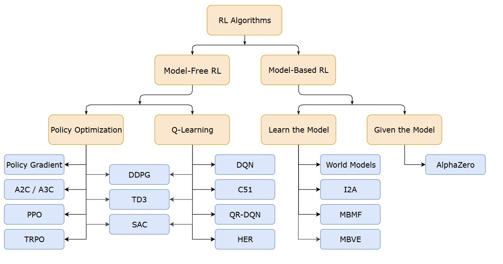
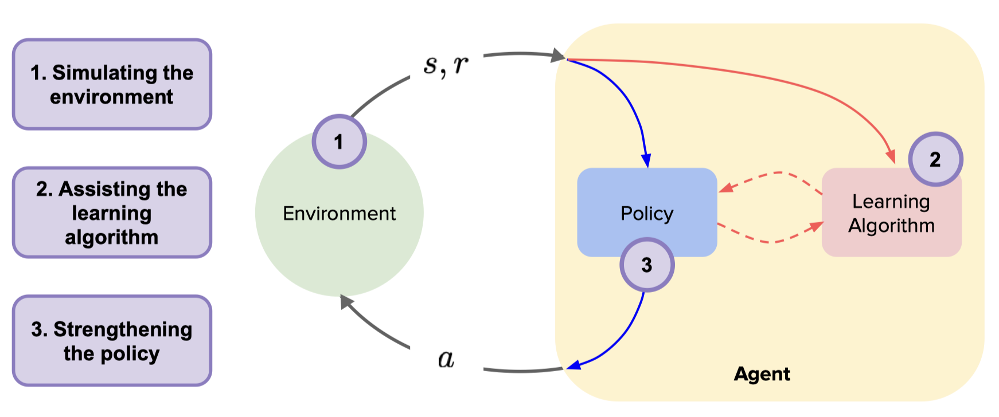

# Model-Free vs Model-Based RL

## The Core Difference

**Model-Free:** Learn by trial and error directly in the environment  
**Model-Based:** Build a mental model of the world, then plan using that model



Reference: https://spinningup.openai.com/en/latest/spinningup/rl_intro2.html



---

## The Chess Analogy ♟️

### Model-Free (Learn by Doing)

```
You: *Move pawn*
Opponent: *Takes your queen*
You: "Ouch! That hurt. Don't do that move again."

You: *Try different move*
Opponent: *You win*
You: "Great! Remember that move was good."

After 10,000 games → You're decent at chess
But you don't really "understand" chess, you just remember patterns.
```

**Characteristics:**
- Learn directly from experience
- No understanding of "why" things work
- Like learning to walk by falling thousands of times

### Model-Based (Learn by Thinking)

```
You: *Think* "If I move pawn here..."
     "...opponent will probably take it..."
     "...then I can move knight..."
     "...checkmate in 3 moves!"

You: *Move pawn* (confident in the plan)
```

**Characteristics:**
- Build a mental simulation of the game
- "Imagine" outcomes before acting
- Can plan many steps ahead

---

## Real-World Analogy: Learning to Drive 🚗

### Model-Free Approach

```
Day 1: Press gas → Car lurches forward → "Too much gas!"
Day 2: Press gas lightly → Smooth start → "Better!"
Day 3: Turn wheel too fast → Swerve → "Careful with steering!"
...
After 100 hours: Good driver (but can't explain physics)
```

**You learned:**
- "Gas pedal = go forward"
- "Too much gas = bad"
- "Turn wheel = car turns"

**You DON'T know:**
- How the engine works
- Physics of friction
- Why the car turns

### Model-Based Approach

```
Before driving: Study car mechanics
                Learn physics of motion
                Understand friction, momentum
                Build mental model of "how car behaves"

First time driving: "Okay, I know heavier cars need more braking distance..."
                   "The road is wet, so friction is lower..."
                   *Applies knowledge consciously*
```

**You learned:**
- The "physics model" of driving
- Can predict outcomes before acting
- Can adapt to new situations (snow, different car)

---

## Technical Comparison

| Aspect | Model-Free | Model-Based |
|--------|-----------|-------------|
| **Learns** | Optimal actions directly | Model of environment + planning |
| **Data efficiency** | Needs LOTS of data | More sample efficient |
| **Computation** | Simple | Expensive (must "imagine") |
| **Adapts to change** | Must relearn | Update model, replan |
| **Examples** | Q-Learning, DQN, PPO | AlphaGo, Dyna-Q, MuZero |

---

## When to Use Which?

### Use Model-Free When:
- Environment is too complex to model (real world)
- You have lots of data/experience
- Speed matters (no time to "think")
- Actions are simple

**Examples:**
- Playing Atari games (DQN)
- Training LLMs (PPO/RLHF)
- Robotics with simple tasks

### Use Model-Based When:
- Data is expensive (robot might break)
- Environment has clear rules (games)
- You need to plan ahead
- Safety is critical

**Examples:**
- AlphaGo/AlphaZero (game rules are known)
- Self-driving cars (physics is known)
- Robot arm manipulation

---

## The Hybrid: Dyna Architecture

**Best of both worlds:** Learn a model AND use direct experience!

```
┌─────────────────────────────────────────────────────────────┐
│                    DYNA ARCHITECTURE                        │
├─────────────────────────────────────────────────────────────┤
│                                                             │
│    Real Experience:                                         │
│    ─────────────────                                        │
│    Agent → Environment → [s, a, s', r] → Update Q-table     │
│                              ↓                              │
│                    Also update World Model                  │
│                                                             │
│    Simulated Experience (Dreaming):                         │
│    ────────────────────────────────                         │
│    Agent → World Model → [s, a, s', r] → Update Q-table     │
│           (imagined)     (predicted)                        │
│                                                             │
│    Result: 10x faster learning!                             │
│                                                             │
└─────────────────────────────────────────────────────────────┘
```

---

## For Our Projects

| Project | Approach | Why |
|---------|----------|-----|
| **P0: Frozen Lake** | Model-Free (Q-Learning) | Simple, learning basics |
| **P1: Cliff Walking** | Model-Free (Q-Learning) | Direct experience works |
| **P4: Coding Agent** | Model-Free (PPO/DPO) | LLMs are too complex to model |

**Note:** For LLM agents, we almost always use **Model-Free** because:
1. The "environment" is too complex (compilers, execution, etc.)
2. LLMs themselves are like models (they already "know" things)
3. RLHF/DPO are model-free approaches

---

## Quick Summary

| | Model-Free | Model-Based |
|---|------------|-------------|
| **Analogy** | Learning to ride a bike by falling | Reading physics book first |
| **Pros** | Simple, works anywhere | Efficient, can plan |
| **Cons** | Needs lots of data | Model might be wrong |
| **Our focus** | ✅ This is what we'll use | Worth knowing, less common |

---

**Bottom Line:**

> "Model-Free = Practice directly on the field"  
> "Model-Based = Practice in your head first, then play"

For our coding agent journey, **Model-Free RL (PPO, DPO)** is the path. The LLM already has a "world model" kinda built-in from pretraining!
