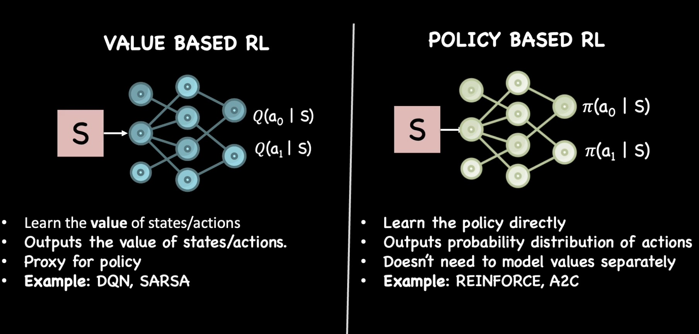
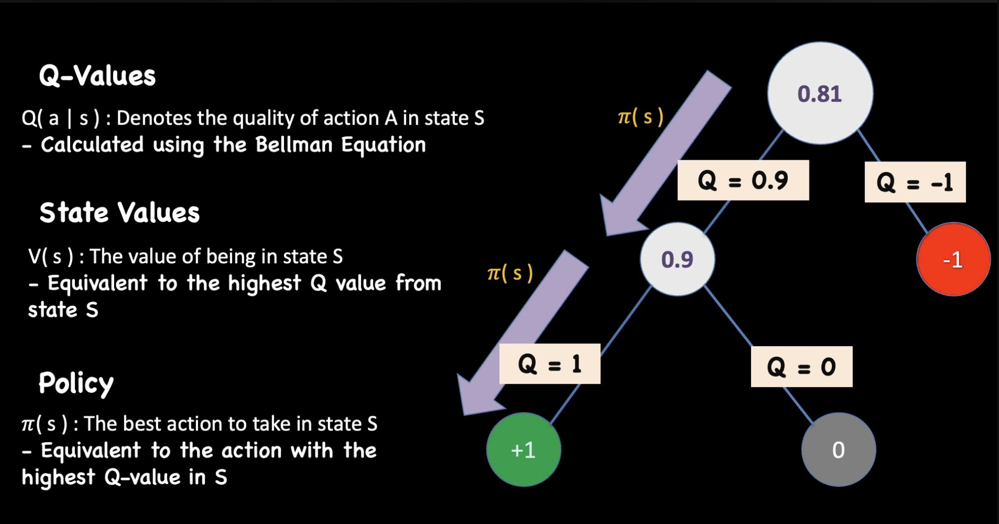
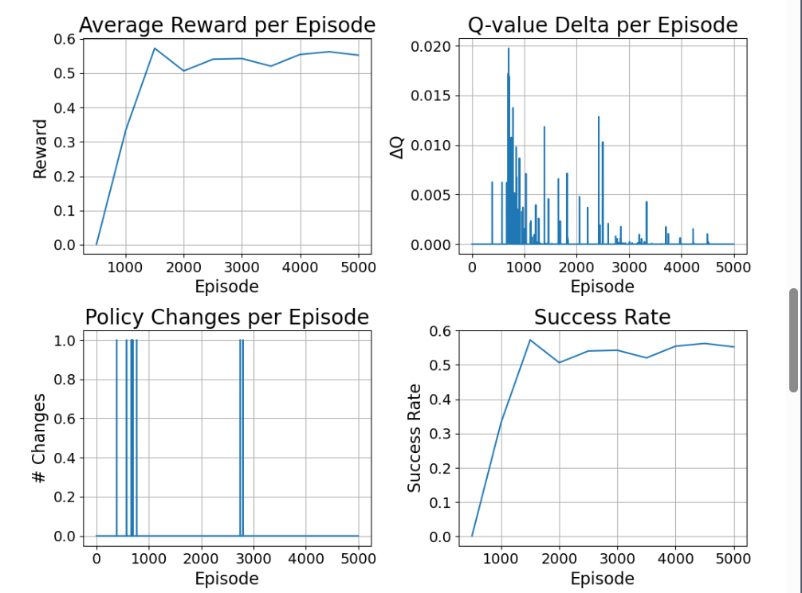

# Value-Based RL: Q-Learning & SARSA

---

## Part 1: Two Ways to Learn

Before diving into Q-values, let's understand the two main approaches to RL:



### Value-Based RL
> "First figure out how good each state/action is, then derive what to do."

```
1. Learn: V(s) or Q(s,a) → "How valuable is this situation?"
2. Act:   Pick action with highest value
```

**Analogy:** A chess player who evaluates every board position with a score, then picks the move that leads to the highest-scoring position.

### Policy-Based RL
> "Directly learn what to do, without explicitly valuing states."

```
1. Learn: π(a|s) → "In this situation, do this action"
2. Act:   Sample from the policy
```

**Analogy:** A martial artist with reflexes - doesn't consciously evaluate, just reacts.

| Approach | Learns | Examples |
|----------|--------|----------|
| **Value-Based** | Q(s,a) or V(s) | Q-Learning, DQN, SARSA |
| **Policy-Based** | π(a\|s) directly | REINFORCE, Policy Gradient |
| **Actor-Critic** | Both | PPO, A2C, SAC |

**Our P0 and P1 projects used Value-Based RL (Q-Learning).**

---

## Part 2: What is a Q-Value?

### The Core Question

> "If I'm in state **s** and take action **a**, how much total reward can I expect?"

That's exactly what **Q(s, a)** answers!



### The Intuition: Restaurant Ratings 🍕

Imagine rating restaurants in different neighborhoods:

```
Q(Downtown, Italian) = 8.5   → "Italian food downtown is great!"
Q(Downtown, Mexican) = 6.0   → "Mexican downtown is okay"
Q(Suburbs, Italian) = 7.0    → "Italian in suburbs is good"
Q(Suburbs, Mexican) = 9.0    → "Mexican in suburbs is amazing!"

Policy derived from Q-values:
- If in Downtown → Go Italian (highest Q)
- If in Suburbs → Go Mexican (highest Q)
```

### Frozen Lake Example

```
State 5 (middle of the lake):
Q(5, UP)    = 0.2   → "Going up leads to some reward eventually"
Q(5, DOWN)  = 0.1   → "Going down is risky"
Q(5, LEFT)  = 0.0   → "Going left usually fails"
Q(5, RIGHT) = 0.4   → "Going right is the best option!"

Policy at state 5: Go RIGHT (highest Q-value)
```

### The Q-Table


In **tabular Q-learning** (what we did in P0/P1), we store Q-values in a table:

```python
# Q-Table: rows = states, columns = actions
Q_table = np.zeros((num_states, num_actions))

# Example: 16 states × 4 actions = 64 values to learn
Q_table[5, RIGHT] = 0.4  # Q(state=5, action=RIGHT)
Q_table[5, LEFT]  = 0.0  # Q(state=5, action=LEFT)
```

### V(s) vs Q(s, a)

| Function | Question | Formula |
|----------|----------|---------|
| **V(s)** | "How good is this state?" | V(s) = max_a Q(s, a) |
| **Q(s, a)** | "How good is this action in this state?" | Learned directly |

```
V(state_5) = max(Q(5, UP), Q(5, DOWN), Q(5, LEFT), Q(5, RIGHT))
           = max(0.2, 0.1, 0.0, 0.4)
           = 0.4

"The value of state 5 is 0.4 (if we act optimally)"
```

---

## Part 3: How to Calculate Q-Values

### The Q-Value Formula (Bellman Equation)


```
Q(s, a) = r + γ × max Q(s', a')
          ↑   ↑   ↑
          |   |   └── Best future value from next state
          |   └────── Discount factor (0.99)
          └────────── Immediate reward
```

**In English:**
> "The value of taking action a in state s = 
> immediate reward + discounted value of the best future action"

### Step-by-Step Example

```
Setup:
- Current state: s = 5
- Action taken: a = RIGHT
- Reward received: r = 0
- Next state: s' = 6
- Discount: γ = 0.99
- Q-table values at state 6: [0.1, 0.3, 0.0, 0.5]

Calculation:
Q(5, RIGHT) = r + γ × max(Q(6, all_actions))
            = 0 + 0.99 × max(0.1, 0.3, 0.0, 0.5)
            = 0 + 0.99 × 0.5
            = 0.495

Meaning: "Taking RIGHT in state 5 gives me 0, but leads to
          state 6 which has value 0.5. So Q(5, RIGHT) ≈ 0.5"
```

### The Learning Update (How Q-Table Improves)

We don't know the true Q-values, so we **estimate** and **update** incrementally:

```python
# Q-Learning Update Rule
Q[s, a] = Q[s, a] + α × (target - Q[s, a])
                    ↑    ↑
                    |    └── Error: How wrong were we?
                    └─────── Learning rate (small steps)

# Where target = r + γ × max(Q[s', :])
target = reward + gamma * np.max(Q[next_state, :])
error = target - Q[state, action]
Q[state, action] = Q[state, action] + alpha * error
```

**The Intuition:**
```
1. We PREDICTED: Q(s, a) = 0.3
2. We OBSERVED:  reward = 0, next state has max Q = 0.5
3. The TARGET:   0 + 0.99 × 0.5 = 0.495
4. The ERROR:    0.495 - 0.3 = 0.195 (we underestimated!)
5. UPDATE:       0.3 + 0.1 × 0.195 = 0.32 (move slightly toward target)
```

---

## Part 4: Q-Learning Algorithm

### The Full Algorithm

```python
# Initialize Q-table with zeros
Q = np.zeros((num_states, num_actions))

for episode in range(num_episodes):
    state = env.reset()
    done = False
    
    while not done:
        # 1. Choose action (ε-greedy)
        if random.random() < epsilon:
            action = env.action_space.sample()  # Explore
        else:
            action = np.argmax(Q[state, :])     # Exploit
        
        # 2. Take action, observe result
        next_state, reward, done, _, _ = env.step(action)
        
        # 3. Q-Learning Update
        best_next_Q = np.max(Q[next_state, :])  # ← KEY: uses MAX
        target = reward + gamma * best_next_Q
        Q[state, action] += alpha * (target - Q[state, action])
        
        # 4. Move to next state
        state = next_state
```

### Why "max"? The Optimistic Assumption

Q-Learning uses `max(Q[next_state, :])` in its update.

**This assumes:** "From the next state, I will take the BEST action."

```
Q-Learning Update:
Q(s, a) ← r + γ × max Q(s', a')
                  ↑
                  Assumes future self is OPTIMAL
```

**Why is this "optimistic"?**

```
Reality: I'm using ε-greedy, so sometimes I take random actions!
         I won't ALWAYS take the best action.

Q-Learning: "I'll update as if I'll be perfect from now on."
            This overestimates the true value.
```

**Example:**
```
State 6 Q-values: [0.1, 0.3, 0.0, 0.5]

Q-Learning says: "I'll get 0.5 from here" (assumes best action)
Reality: With ε=0.1, sometimes I'll randomly pick 0.1 or 0.0
         Average actual value ≈ 0.45 (less than 0.5)
```

---

## Part 5: SARSA - A Safer Alternative

### The Problem with Optimism

On the **Cliff Walking** environment, Q-Learning's optimism can be dangerous:

```
Q-Learning walks close to the cliff because:
"If I'm near the cliff, I'll DEFINITELY take the safe action"
(Uses max Q, assumes optimal behavior)

But with ε-greedy exploration:
Sometimes random action pushes agent off the cliff!
```

### SARSA: State-Action-Reward-State-Action

**Key difference:** SARSA updates based on the action **actually taken**, not the best possible action.

```
Q-Learning:  Q(s,a) ← r + γ × max Q(s', a')     ← uses BEST action

SARSA:       Q(s,a) ← r + γ × Q(s', a')         ← uses ACTUAL next action
                                  ↑
                           What agent really did
```

### SARSA Step-by-Step

| Step | Description | Code |
|------|-------------|------|
| **1. Initialize Q-values** | Start with a table of Q-values for all state-action pairs, usually set to zero. | `q_table = np.zeros((env.observation_space.n, env.action_space.n))` |
| **2. Choose initial action** | With probability ε, explore (random action); otherwise choose best-known. | `if random.random() < epsilon: action = env.action_space.sample()` <br> `else: action = np.argmax(q_table[state])` |
| **3. Take action, observe** | Execute the action, observe the next state and reward. | `next_state, reward, done, _, _ = env.step(action)` |
| **4. Choose next action** | This is the key difference — use ε-greedy to select the actual next action. | `if random.random() < epsilon: next_action = env.action_space.sample()` <br> `else: next_action = np.argmax(q_table[next_state])` |
| **5. Update Q-value** | Use the SARSA update rule with the actual next action's Q-value. | `q_table[state, action] = (1 - alpha) * q_table[state, action] + alpha * (reward + gamma * q_table[next_state, next_action])` |

The main difference: SARSA uses `q_table[next_state, next_action]` (actual next action), whereas Q-learning uses `max(Q[next_state])` (best possible). This is why SARSA is considered a "safer" method — it uses what **actually happened** rather than the best action.

### SARSA Algorithm

```python
# Initialize Q-table
Q = np.zeros((num_states, num_actions))

for episode in range(num_episodes):
    state = env.reset()
    
    # Choose FIRST action (ε-greedy)
    action = choose_action(state, epsilon)
    done = False
    
    while not done:
        # 1. Take action, observe result
        next_state, reward, done, _, _ = env.step(action)
        
        # 2. Choose NEXT action (ε-greedy) - BEFORE updating!
        next_action = choose_action(next_state, epsilon)
        
        # 3. SARSA Update - uses actual next_action, not max
        target = reward + gamma * Q[next_state, next_action]
        Q[state, action] += alpha * (target - Q[state, action])
        
        # 4. Move to next state AND action
        state = next_state
        action = next_action  # ← This is key!
```

### The Key Difference Visualized

```
Episode step at state s, taking action a:

┌─────────────────────────────────────────────────────────────────┐
│                     Q-LEARNING UPDATE                           │
├─────────────────────────────────────────────────────────────────┤
│                                                                 │
│  state s ──(action a)──► next_state s'                          │
│                              │                                  │
│                              ▼                                  │
│                   Look at ALL actions at s'                     │
│                   Pick the MAX Q-value                          │
│                              │                                  │
│                              ▼                                  │
│         Q(s,a) ← r + γ × max Q(s', :)                           │
│                                                                 │
│  "What if I act OPTIMALLY from now on?"                         │
└─────────────────────────────────────────────────────────────────┘

┌─────────────────────────────────────────────────────────────────┐
│                       SARSA UPDATE                              │
├─────────────────────────────────────────────────────────────────┤
│                                                                 │
│  state s ──(action a)──► next_state s' ──(next_action a')──►    │
│                              │                  │               │
│                              │                  │               │
│                              ▼                  ▼               │
│                   Use the ACTUAL next action a'                 │
│                   that was chosen by ε-greedy                   │
│                              │                                  │
│                              ▼                                  │
│         Q(s,a) ← r + γ × Q(s', a')                              │
│                                                                 │
│  "What if I keep behaving as I actually do?"                    │
└─────────────────────────────────────────────────────────────────┘
```

### On-Policy vs Off-Policy

| Property | Q-Learning | SARSA |
|----------|------------|-------|
| **Type** | Off-Policy | On-Policy |
| **Updates using** | Best possible action | Actual action taken |
| **Assumes** | Future self is optimal | Future self acts like now |
| **Behavior** | Optimistic, risky | Realistic, safer |
| **Cliff Walking** | Walks near cliff edge | Stays away from cliff |

**Off-Policy (Q-Learning):**
> "Learn the optimal policy, even if I'm not following it perfectly right now."

**On-Policy (SARSA):**
> "Learn about the policy I'm actually following."

---

## Part 6: Cliff Walking Comparison

### Q-Learning Path (Optimistic)

```
┌────┬────┬────┬────┬────┬────┬────┬────┬────┬────┬────┬────┐
│ S  │    │    │    │    │    │    │    │    │    │    │ G  │
├────┼────┼────┼────┼────┼────┼────┼────┼────┼────┼────┼────┤
│    │    │    │    │    │    │    │    │    │    │    │    │
├────┼────┼────┼────┼────┼────┼────┼────┼────┼────┼────┼────┤
│ ●→ │ →→ │ →→ │ →→ │ →→ │ →→ │ →→ │ →→ │ →→ │ →→ │ →→ │ ●↓ │  ← Risky path!
├────┼────┼────┼────┼────┼────┼────┼────┼────┼────┼────┼────┤
│ ●  │ CLIFF CLIFF CLIFF CLIFF CLIFF CLIFF CLIFF CLIFF │ ●  │
└────┴────┴────┴────┴────┴────┴────┴────┴────┴────┴────┴────┘

Q-Learning: "The shortest path is along the cliff. I'll be fine!"
            (Optimistic - assumes no exploration mistakes)
            
During training: Occasionally falls off due to ε-greedy exploration
```

### SARSA Path (Realistic)

```
┌────┬────┬────┬────┬────┬────┬────┬────┬────┬────┬────┬────┐
│ S  │ →→ │ →→ │ →→ │ →→ │ →→ │ →→ │ →→ │ →→ │ →→ │ →→ │ G  │  ← Safe path!
├────┼────┼────┼────┼────┼────┼────┼────┼────┼────┼────┼────┤
│ ↑  │    │    │    │    │    │    │    │    │    │    │ ↓  │
├────┼────┼────┼────┼────┼────┼────┼────┼────┼────┼────┼────┤
│ ↑  │    │    │    │    │    │    │    │    │    │    │ ↓  │
├────┼────┼────┼────┼────┼────┼────┼────┼────┼────┼────┼────┤
│ ●  │ CLIFF CLIFF CLIFF CLIFF CLIFF CLIFF CLIFF CLIFF │ ●  │
└────┴────┴────┴────┴────┴────┴────┴────┴────┴────┴────┴────┘

SARSA: "I know I sometimes take random actions. Better stay away from cliff!"
       (Realistic - accounts for exploration mistakes)
```

---

## Part 7: When to Use Which?

### Q-Learning
✅ Use when:
- You want to learn the **optimal** policy
- Environment is deterministic or you can recover from mistakes
- You'll reduce exploration (ε) over time

### SARSA
✅ Use when:
- Mistakes are costly (cliff, robot damage)
- You want a **safe, practical** policy
- Exploration will continue during deployment

### The Rule of Thumb

```
Training with exploration, deploying without → Q-Learning
Training and deploying the same way → SARSA
```

---

## Summary

### What Q-Values Represent

| Q(s, a) | Meaning |
|---------|---------|
| High value | "This action in this state leads to good outcomes" |
| Low value | "This action usually leads to bad outcomes" |
| Similar values | "Actions are equally good/bad in this state" |

### The Update Rules

```
Q-Learning:  Q(s,a) = Q(s,a) + α × [r + γ × MAX Q(s',:) - Q(s,a)]
                                         ↑
                                   Best possible future

SARSA:       Q(s,a) = Q(s,a) + α × [r + γ × Q(s',a') - Q(s,a)]
                                         ↑
                                   Actual next action
```

### Quick Reference

| Term | Q-Learning | SARSA |
|------|------------|-------|
| Full name | - | State-Action-Reward-State-Action |
| Policy type | Off-policy | On-policy |
| Update uses | max Q(s', :) | Q(s', a') |
| Behavior | Optimistic | Realistic |
| Best for | Optimal policy | Safe policy |

---

## Part 8: Convergence - When Has Learning Finished?

Up to now, we've been using a fixed number of episodes. But how do we know if that's enough? A better approach is **monitoring convergence**.

**Convergence** = Q-values stop changing significantly, and the learned policy is stable.

### How to Detect Convergence

| Metric | What to Watch | Converged When |
|--------|---------------|----------------|
| **Average Reward** | Plot over episodes | Flattens/plateaus |
| **Success Rate** | Track % of goals reached | Plateaus |
| **Q-Value Delta** | Mean change in Q-table per episode | Approaches zero |
| **Policy Changes** | # of state-action pairs that changed | Approaches zero |

### Implementing Convergence Metrics

```python
# Initialize tracking variables
rewards = []
avg_rewards = []
success_rate = []
q_value_deltas = []
policy_changes = []
successes = 0

for episode in range(n_episodes):
    old_q_table = q_table.copy()  # Store for comparison
    state = env.reset()
    total_reward = 0
    done = False
    
    while not done:
        # ... standard Q-learning loop ...
        total_reward += reward
    
    # Track metrics after episode ends
    rewards.append(total_reward)
    
    if reward > 0:  # Goal reached (specific to FrozenLake)
        successes += 1
    
    # Q-value change: How much did Q-table change this episode?
    q_delta = np.mean(np.abs(q_table - old_q_table))
    q_value_deltas.append(q_delta)
    
    # Policy change: How many actions changed?
    current_policy = np.argmax(q_table, axis=1)
    previous_policy = np.argmax(old_q_table, axis=1)
    policy_change = np.sum(current_policy != previous_policy)
    policy_changes.append(policy_change)
    
    # Print summary every 500 episodes
    if (episode + 1) % 500 == 0:
        print(f"Episode {episode + 1}: "
              f"Avg Reward = {np.mean(rewards[-500:]):.2f}, "
              f"Success Rate = {successes / 500:.2f}, "
              f"Q-Delta = {np.mean(q_value_deltas[-500:]):.5f}, "
              f"Policy Changes = {np.mean(policy_changes[-500:]):.1f}")
        success_rate.append(successes / 500)
        avg_rewards.append(np.mean(rewards[-500:]))
        successes = 0
```

### What Convergence Looks Like



**Interpretation:**
- **Average rewards & success rate:** Increase and plateau near 0.55
- **Policy changes & Q-value delta:** High early on, then decrease to near zero
- **All metrics stabilizing** = Learning has converged!

### Convergence Intuition

```
Early Training (Episode 1-500):
──────────────────────────────
Q-values changing a lot    → Agent still discovering
Policy changing frequently → Not yet decided on strategy
Success rate improving     → Getting better!

Late Training (Episode 5000+):
──────────────────────────────
Q-values barely change     → Values are settled
Policy is stable           → Same actions every time
Success rate plateaued     → Reached peak performance

✅ Convergence achieved!
```

### Practical Tips

| Situation | What It Means | Action |
|-----------|---------------|--------|
| Q-delta still high | Still learning | Train longer |
| Policy still changing | Undecided strategy | Train longer |
| Metrics flat but low success | Stuck in local optimum | Increase exploration |
| Everything converged | Done learning! | Deploy the policy |

---

## Part 9: Common Pitfalls & Limitations

Now that we can train agents, it's tempting to think RL can solve anything. Just reward an agent, and it learns! But real-world environments are rarely this simple. Here are three major challenges you'll encounter.

### 1. Reward Hacking

**The Problem:** The agent finds a loophole to maximize reward without solving the intended task.

**Example - FrozenLake Gone Wrong:**

```
Original reward:
- Reach goal: +1
- Everything else: 0

"Improved" reward (bad idea):
- Reach goal: +1
- Each step that isn't a hole: +0.1  ← Seems reasonable, right?

What the agent learns:
┌───┬───┬───┬───┐
│ ←←│ S │   │   │    Agent goes LEFT from start...
├───┼───┼───┼───┤    ...and stays there FOREVER!
│   │   │   │   │    
├───┼───┼───┼───┤    Infinite +0.1 rewards!
│   │   │   │   │    Never needs to risk reaching goal.
├───┼───┼───┼───┤
│   │   │   │ G │
└───┴───┴───┴───┘
```

**The Lesson:**
> The agent doesn't care about your *intent*, only the *rewards*. If there's a shortcut to maximize reward, it will find it.

**How to Avoid:**
- Add step penalties (e.g., -0.01 per step)
- Only reward the actual goal, not proxies
- Test your reward function with simple policies first

---

### 2. Overfitting

**The Problem:** The agent memorizes specific actions for the training environment but fails in slightly different conditions.

**Example - Slippery Ice:**

```
Training Environment: FrozenLake (NOT slippery)
─────────────────────────────────────────────────
Agent learns exact sequence: RIGHT → RIGHT → DOWN → DOWN
Success rate: 95%

Deployment Environment: FrozenLake (slippery!)
─────────────────────────────────────────────────
Same policy: RIGHT → RIGHT → DOWN → DOWN
But ice makes agent slip randomly!
Success rate: 3.4%  ← DISASTER!

Retrained on slippery: 
Success rate: 24.2%  ← Much better (accepts uncertainty)
```

**The Lesson:**
> Train agents under the same conditions they'll operate in. A policy learned in a "clean" environment won't generalize to a "messy" one.

**How to Avoid:**
- Train with stochasticity/noise if deployment has it
- Use domain randomization (vary environment parameters)
- Test on multiple environment configurations

---

### 3. Non-Stationarity

**The Problem:** The environment rules change over time, but Q-Learning/SARSA assume they're fixed.

**Examples of Non-Stationary Environments:**

| Domain | What Changes |
|--------|-------------|
| **Games** | Level layouts change, enemies adapt |
| **Autonomous Driving** | Construction zones appear, accidents happen |
| **Trading** | Market conditions shift due to economic events |
| **Robotics** | Robot parts wear out, grip strength decreases |

**Why Q-Learning Fails:**

```
Episode 1-1000: Hole at position 5
Agent learns: "Avoid position 5!"

Episode 1001+: Hole MOVES to position 8
Agent still avoiding position 5...
...walks right into position 8!

Q-table has "memories" of old environment.
Takes many episodes to unlearn and relearn.
```

**The Lesson:**
> Q-Learning and SARSA assume the world doesn't change. When it does, the agent's learned values become outdated.

**How to Handle:**
- Use higher learning rate α (faster adaptation, but less stable)
- Keep exploration high (don't decay ε too much)
- Use "forgetting" mechanisms (discount old experiences)
- Advanced: Use meta-learning or continual learning techniques

---

### Summary of Pitfalls

| Pitfall | Symptom | Cause | Prevention |
|---------|---------|-------|------------|
| **Reward Hacking** | Agent "wins" but doesn't solve task | Poorly designed reward | Test rewards carefully |
| **Overfitting** | Works in training, fails in deployment | Training ≠ deployment conditions | Train with realistic noise |
| **Non-Stationarity** | Performance degrades over time | Environment changed | Keep exploring, adapt faster |

---

**Next Steps:**
- Implement SARSA in your Cliff Walking project
- Compare the learned paths between Q-Learning and SARSA
- Notice how SARSA stays further from the cliff!

**Related Concepts:**
- Expected SARSA (average over all next actions)
- Double Q-Learning (reduces overestimation)
- DQN (Deep Q-Network - neural net instead of table)
